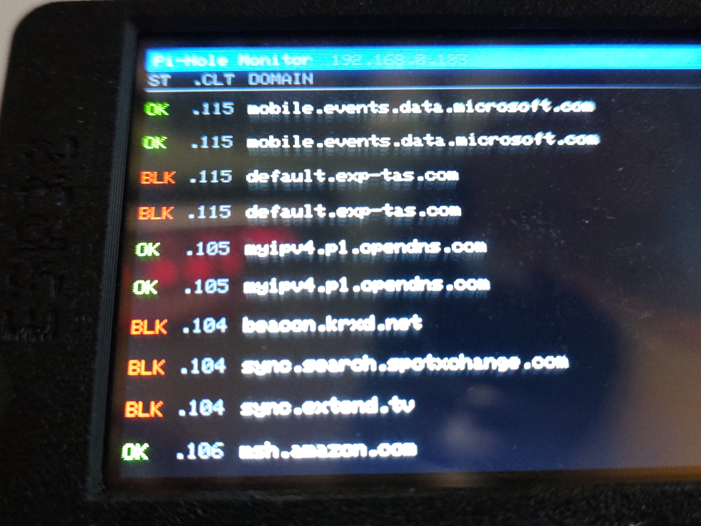

# CYDPiHole — Pi-hole Monitor for the Cheap Yellow Display

A real-time Pi-hole DNS query monitor running on the **ESP32 CYD (Cheap Yellow Display)**. Fetches the last 10 DNS queries from your local Pi-hole v6 instance and displays them on the built-in 320×240 TFT — updating every 5 seconds.



---

## Features

- Displays the last 10 DNS queries with **status**, **client IP** (last octet), and **domain**
- Color-coded results: 🟢 **OK** (allowed) and 🔴 **BLK** (blocked)
- First-boot **captive portal** for WiFi and Pi-hole setup — no code editing required
- Hold the **BOOT button** at startup to re-enter setup at any time
- Supports both **passwordless** and **password-protected** Pi-hole v6 installs
- Pi-hole host is configurable via the portal — works with any IP or hostname

---

## Requirements

### Hardware
- **ESP32 CYD** board (ESP32-2432S028R or compatible "Cheap Yellow Display")

### Software / Services
- [PlatformIO](https://platformio.org/) (VSCode extension recommended)
- **Pi-hole v6** running on your local network
  - Pi-hole v5 is **not supported** — the v6 REST API is required

---

## Setup

### 1. Flash the firmware

1. Clone this repository and open it in VSCode with the PlatformIO extension
2. Connect your CYD board via USB
3. Click **Upload** in PlatformIO (or run `pio run --target upload`)

### 2. Configure WiFi and Pi-hole (first boot)

On first boot the CYD will open a setup access point:

1. On your phone or PC, connect to the WiFi network: **`CYDPiHole_Setup`** (no password)
2. Open a browser and go to **`192.168.4.1`**
3. Fill in the form:
   - **WiFi Network Name (SSID)** — your 2.4 GHz WiFi name
   - **WiFi Password** — leave blank for open networks
   - **Pi-hole IP / Hostname** — just the IP, e.g. `192.168.0.103` *(no `http://`, no `/admin/`)*
   - **Pi-hole Password** — leave blank if your Pi-hole has no password set
4. Tap **Save & Connect**

The display will connect to your WiFi and start showing queries within a few seconds.

> ⚠️ The ESP32 supports **2.4 GHz WiFi only**.

### 3. Re-entering setup

Hold the **BOOT button** (GPIO 0) while powering on or pressing reset. Keep holding until the setup screen appears.

---

## Display Layout

```
[ Pi-Hole Monitor         192.168.0.103 ]
[  ST  | .CLT | DOMAIN                  ]
[────────────────────────────────────── ]
[  OK  | .5   | example.com             ]
[ BLK  | .12  | ads.tracker.net         ]
  ...
```

| Column | Description |
|--------|-------------|
| **ST** | `OK ` (green) = allowed &nbsp;/&nbsp; `BLK` (red) = blocked |
| **.CLT** | Last octet of the client IP (e.g. `.5` = `192.168.0.5`) |
| **DOMAIN** | Queried domain, truncated with `..` if too long |

---

## Hardware Pinout (CYD)

| Function | GPIO |
|----------|------|
| TFT DC | 2 |
| TFT CS | 15 |
| TFT SCK | 14 |
| TFT MOSI | 13 |
| TFT MISO | 12 |
| Backlight | 21 |
| BOOT button | 0 |

---

## Libraries Used

All managed automatically by PlatformIO:

- [`moononournation/GFX Library for Arduino @ 1.4.7`](https://github.com/moononournation/Arduino_GFX) — ILI9341 display driver
- [`bblanchon/ArduinoJson @ ^7`](https://arduinojson.org/) — Pi-hole API JSON parsing
- `WebServer`, `DNSServer`, `Preferences` — built into the ESP32 Arduino core (captive portal + NVS storage)
- `HTTPClient`, `WiFiClient` — built into the ESP32 Arduino core (HTTP requests)

---

## Troubleshooting

| Error on screen | Cause | Fix |
|-----------------|-------|-----|
| `Fetch failed: HTTP 404` | Wrong Pi-hole host entered | Hold BOOT to re-enter setup. Enter **only** the IP, e.g. `192.168.0.103` |
| `Fetch failed: HTTP 401` | Wrong Pi-hole password | Hold BOOT to re-enter setup and correct the password |
| `Fetch failed: Auth HTTP 4xx` | Pi-hole unreachable | Check the IP address and that Pi-hole is running |
| `Fetch failed: No Pi-hole host set` | Setup was skipped | Hold BOOT to complete setup |
| `WiFi failed: "YourSSID"` | Wrong WiFi credentials or out of range | Hold BOOT to re-enter setup |

---

## License

MIT
