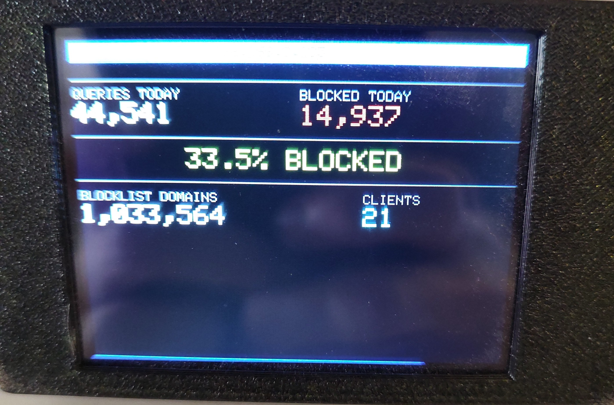
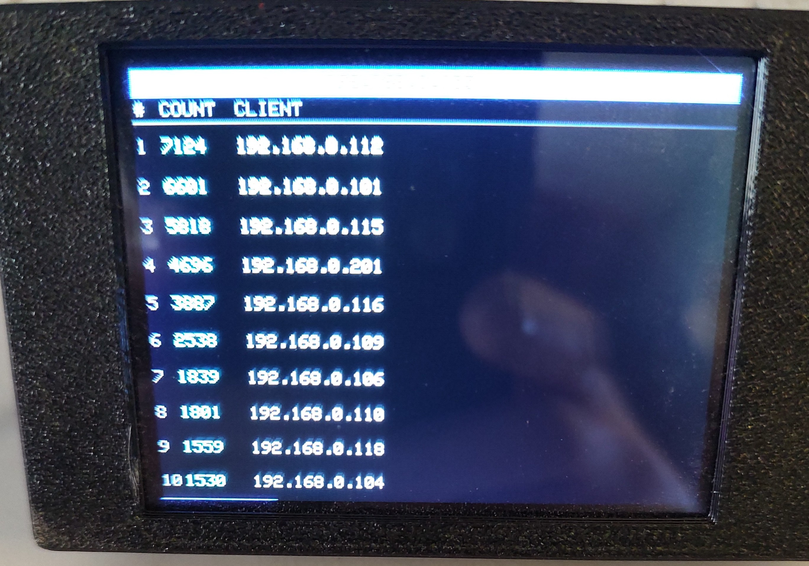
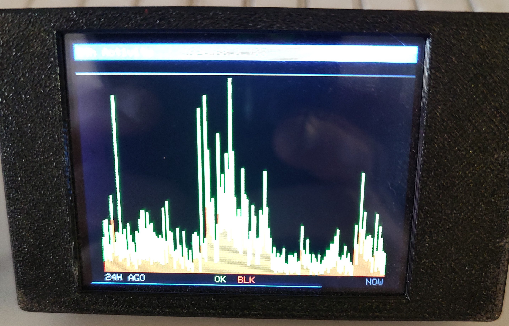

# CYDPiHole — Pi-hole Monitor for the Cheap Yellow Display

A real-time Pi-hole DNS dashboard running on the **ESP32 CYD (Cheap Yellow Display)**. Displays live DNS queries, today's stats, top blocked domains, top clients, and a 24-hour activity graph — all from your local Pi-hole v6 instance, updating every 5 seconds.


---

## Features

- **5 display modes** — swipe left/right on the touchscreen to cycle between modes
- **Mode 1 — Live Feed:** last 10 DNS queries with allowed/blocked status, client IP, and domain
- **Mode 2 — Stats Dashboard:** queries today, blocked today, % blocked, blocklist size, active clients
- **Mode 3 — Top Blocked:** the 10 most-blocked domains today with hit counts
- **Mode 4 — Top Clients:** the 10 most active devices on your network by query count
- **Mode 5 — 24h Activity Graph:** stacked bar chart of DNS traffic over the last 24 hours (green = allowed, red = blocked)
- **Countdown bar** — 1px progress bar at the bottom edge shows time until next refresh
- **Stale data preserved on error** — brief network hiccups show an error in the header only; last good data stays visible
- Color-coded results: 🟢 **OK** (allowed) and 🔴 **BLK** (blocked)
- First-boot **captive portal** for WiFi and Pi-hole setup — no code editing required
- **Hold BOOT 3 seconds** at any time to re-enter setup
- Supports both **passwordless** and **password-protected** Pi-hole v6 installs

---

## Screenshots

| Stats Dashboard | Top Clients | 24h Activity Graph |
|---|---|---|
|  |  |  |

---

## Requirements

### Hardware
- **ESP32 CYD** board (ESP32-2432S028R or compatible "Cheap Yellow Display")

### Software / Services
- [PlatformIO](https://platformio.org/) (VSCode extension recommended)
- **Pi-hole v6** running on your local network
  - Pi-hole v5 is **not supported** — the v6 REST API is required

---

## Setup

### 1. Flash the firmware

1. Clone this repository and open it in VSCode with the PlatformIO extension
2. Connect your CYD board via USB
3. Click **Upload** in PlatformIO (or run `pio run --target upload`)
4. IF YOUR BOARD DISPLAY FLASHES WHITE THEN USE THE INVERTED FOLDER!
### 2. Configure WiFi and Pi-hole (first boot)

On first boot the CYD will open a setup access point:

1. On your phone or PC, connect to the WiFi network: **`CYDPiHole_Setup`** (no password)
2. Open a browser and go to **`192.168.4.1`**
3. Fill in the form:
   - **WiFi Network Name (SSID)** — your 2.4 GHz WiFi name
   - **WiFi Password** — leave blank for open networks
   - **Pi-hole IP / Hostname** — just the IP, e.g. `192.168.0.103` *(no `http://`, no `/admin/`)*
   - **Pi-hole Password** — leave blank if your Pi-hole has no password set
4. Tap **Save & Connect**

The display will connect to your WiFi and start showing queries within a few seconds.

> ⚠️ The ESP32 supports **2.4 GHz WiFi only**.

### 3. Changing modes

**Touch the screen** to cycle between modes:

| Touch zone | Action |
|------------|--------|
| Right half of screen | Next mode → |
| Left half of screen | ← Previous mode |

You can also press the **BOOT button** briefly to advance to the next mode.

```
Live Feed  ←→  Stats  ←→  Top Blocked  ←→  Top Clients  ←→  24h Activity
```

### 4. Re-entering setup

**Hold the BOOT button for 3 seconds** from any mode. The device will restart directly into the setup portal.

---

## Display Modes

### Mode 1 — Live Feed

```
[ Pi-Hole Monitor         192.168.0.103 ]
[  ST  | .CLT | DOMAIN                  ]
[────────────────────────────────────── ]
[  OK  | .5   | example.com             ]
[ BLK  | .12  | ads.tracker.net         ]
  ...
```

| Column | Description |
|--------|-------------|
| **ST** | `OK ` (green) = allowed &nbsp;/&nbsp; `BLK` (red) = blocked |
| **.CLT** | Last octet of the client IP (e.g. `.5` = `192.168.0.5`) |
| **DOMAIN** | Queried domain, truncated with `..` if too long |

### Mode 2 — Stats Dashboard

```
[ Pi-Hole Stats           192.168.0.103 ]
[────────────────────────────────────── ]
  QUERIES TODAY        BLOCKED TODAY
    44,541               14,937

           33.5% BLOCKED

  BLOCKLIST DOMAINS        CLIENTS
    1,033,564                 21
```

### Mode 3 — Top Blocked

```
[ Top Blocked             192.168.0.103 ]
[  #  | COUNT | DOMAIN                  ]
[────────────────────────────────────── ]
[  1    2847   doubleclick.net          ]
[  2    1203   googleadservices.com     ]
  ...
```

### Mode 4 — Top Clients

```
[ Top Clients             192.168.0.103 ]
[  #  | COUNT | CLIENT                  ]
[────────────────────────────────────── ]
[  1    7124   192.168.0.112            ]
[  2    6601   192.168.0.101            ]
  ...
```

Shows the 10 most active devices on your network by total DNS query count. Displays hostname if available, falls back to IP address.

### Mode 5 — 24h Activity Graph

A stacked bar chart of all DNS traffic over the last 24 hours in 10-minute buckets.
- 🟢 Green = allowed queries
- 🔴 Red = blocked queries
- Left edge = 24 hours ago, right edge = now

---

## Hardware Pinout (CYD)

| Function | GPIO |
|----------|------|
| TFT DC | 2 |
| TFT CS | 15 |
| TFT SCK | 14 |
| TFT MOSI | 13 |
| TFT MISO | 12 |
| Backlight | 21 |
| BOOT button | 0 |
| Touch IRQ | 36 |
| Touch MOSI | 32 |
| Touch MISO | 39 |
| Touch CLK | 25 |
| Touch CS | 33 |

---

## Libraries Used

All managed automatically by PlatformIO:

- [`moononournation/GFX Library for Arduino @ 1.4.7`](https://github.com/moononournation/Arduino_GFX) — ILI9341 display driver
- [`bblanchon/ArduinoJson @ ^7`](https://arduinojson.org/) — Pi-hole API JSON parsing
- [`PaulStoffregen/XPT2046_Touchscreen`](https://github.com/PaulStoffregen/XPT2046_Touchscreen) — touchscreen driver
- `WebServer`, `DNSServer`, `Preferences` — built into the ESP32 Arduino core (captive portal + NVS storage)
- `HTTPClient`, `WiFiClient` — built into the ESP32 Arduino core (HTTP requests)

---

## Troubleshooting

| Error on screen | Cause | Fix |
|-----------------|-------|-----|
| `Fetch failed: HTTP 404` | Wrong Pi-hole host entered | Hold BOOT 3s to re-enter setup. Enter **only** the IP, e.g. `192.168.0.103` |
| `Fetch failed: HTTP 401` | Wrong Pi-hole password | Hold BOOT 3s to re-enter setup and correct the password |
| `Fetch failed: Auth HTTP 4xx` | Pi-hole unreachable | Check the IP address and that Pi-hole is running |
| `ERR: begin() failed` | Brief network hiccup (common during heavy streaming) | Clears automatically on next poll — last data stays on screen |
| `Fetch failed: No Pi-hole host set` | Setup was skipped | Hold BOOT 3s to complete setup |
| `WiFi failed: "YourSSID"` | Wrong WiFi credentials or out of range | Hold BOOT 3s to re-enter setup |

---

## License

MIT

